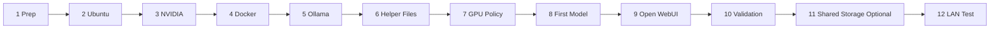

# First Build Execution Checklist

## Purpose

Use this checklist to execute the first Local_LLM deployment on the HP Z8 G4 without having to infer the order from multiple planning documents.

This checklist assumes Ubuntu 24.04 LTS will be installed on bare metal and that the target service stack is Ollama plus Open WebUI.

For the current mixed-workstation requirement, prefer Ubuntu Studio 24.04 LTS unless you have already proven the creative toolchain is compatible with a non-desktop host posture.

## Before You Begin

Keep these rules in front of you while you work:

1. Do not move to the next step until the current step checkpoint passes.
2. Keep one GPU reserved for the workstation unless you deliberately change that plan.
3. Keep Local_LLM hot data on SSD, not on the HDD array or SMB share.
4. Use `docs/z8g4-install-commands.md` whenever you want exact copy-and-paste commands.

## Build Picture



## Short Version

1. Finish host prep and storage decisions.
2. Install Ubuntu and make SSH work.
3. Install the NVIDIA driver and record GPU numbering.
4. Install Docker and Ollama.
5. Copy the Local_LLM helper files to the host.
6. Set the GPU list in `/etc/default/local-llm`.
7. Apply the GPU policy and test one model.
8. Enable Open WebUI.
9. Run the full validation.
10. Only then add optional shared storage and test from another LAN machine.

Current target values:

1. Hostname label: `Skippy`
2. Planned FQDN: `Skippy.aybara.local`
3. Planned IP: `192.168.128.5`
4. Planned Ubuntu admin user: `Daniel`
5. GPU policy: `2` GPUs for Local_LLM and `1` GPU reserved for workstation tasks
6. Storage policy: SSD 1 for OS and apps, SSD 2 for Local_LLM data, RAID10 HDD array for media storage
7. Shared storage: map `\\192.168.128.6\Storage` for shared file access without using it for hot LLM data

## Step 1: Finish Host Prep Decisions

Complete the pre-install decisions in `docs/z8g4-host-prep-checklist.md`.

You should not start the OS install until these are decided:

1. Hostname.
2. LAN addressing method.
3. Boot and data disk layout.
4. Whether one GPU stays reserved for workstation use.
5. Whether the deployment is operator-only or multi-user on day one.

For the current Skippy plan, items 1, 2, and 4 are already chosen, and item 3 should follow `docs/storage-layout.md`.

## Step 2: Install Ubuntu 24.04 LTS

Install Ubuntu 24.04 LTS on the HP Z8 G4.

During install:

1. Enable OpenSSH Server.
2. Create the main admin account.
3. Use the chosen hostname.
4. Apply the planned disk layout.

Immediate post-install commands:

```sh
hostnamectl
lsb_release -a
ip address
sudo apt update
sudo apt full-upgrade -y
sudo reboot
```

Checkpoint:

1. SSH works remotely.
2. The host is updated.
3. The hostname and address match the plan.
4. The SMB share plan is clear before creative workflows begin.

## Step 3: Validate GPUs And Install NVIDIA Driver

Run:

```sh
lspci | grep -i nvidia
ubuntu-drivers devices
sudo ubuntu-drivers autoinstall
sudo reboot
nvidia-smi
nvidia-smi -L
```

Checkpoint:

1. All expected RTX 4060 cards appear.
2. Device numbering is recorded.
3. You know whether the deployment is dedicated-inference mode or mixed-workstation mode.

If mixed-workstation mode is required, keep the chosen inference-only GPU list available for the later environment file.

## Step 4: Install Docker

Run:

```sh
sudo apt install -y docker.io
sudo systemctl enable --now docker
sudo systemctl status docker --no-pager
docker --version
```

Checkpoint:

1. Docker is running.
2. Docker starts at boot.

## Step 5: Install Ollama

Run:

```sh
curl -fsSL https://ollama.com/install.sh | sh
sudo systemctl enable --now ollama
systemctl status ollama --no-pager
```

Checkpoint:

1. `ollama` is installed.
2. The `ollama` service is active.

## Step 6: Install Repository-Backed Host Artifacts

Copy these repository files to the host:

1. `src/local-llm.env.example`
2. `src/apply-ollama-gpu-policy.sh`
3. `src/run-open-webui.sh`
4. `src/local-llm-open-webui.service`
5. `src/validate-local-llm.sh`

Target paths:

1. `/etc/default/local-llm`
2. `/usr/local/bin/apply-ollama-gpu-policy.sh`
3. `/usr/local/bin/local-llm-run-open-webui.sh`
4. `/usr/local/bin/validate-local-llm.sh`
5. `/etc/systemd/system/local-llm-open-webui.service`

Permissions:

1. Helper scripts should be `755`.
2. Environment and service files should be `644`.

## Step 7: Configure The Local_LLM Environment File

Edit `/etc/default/local-llm`.

Set at least:

1. `LOCAL_LLM_EXPECTED_GPUS`
2. `LOCAL_LLM_GPU_DEVICES`
3. `LOCAL_LLM_OLLAMA_HOST`
4. `LOCAL_LLM_OLLAMA_BASE_URL`
5. `LOCAL_LLM_WEBUI_PORT`
6. `LOCAL_LLM_WEBUI_URL`

Recommended examples:

1. Dedicated inference host: `LOCAL_LLM_GPU_DEVICES=0,1,2`
2. Mixed workstation host: `LOCAL_LLM_GPU_DEVICES=1,2`

For the current Skippy plan, mixed workstation mode is required. Use a two-GPU list for Local_LLM after you confirm the actual device numbering with `nvidia-smi -L`. The provisional target posture is to reserve one GPU for the workstation and dedicate the other two to Local_LLM.

## Step 8: Apply Ollama GPU Policy

If GPU reservation is needed, or if you want explicit GPU binding regardless, run:

```sh
sudo /usr/local/bin/apply-ollama-gpu-policy.sh
sudo systemctl daemon-reload
sudo systemctl restart ollama
systemctl show ollama --property=Environment
```

Checkpoint:

1. The override file exists under `/etc/systemd/system/ollama.service.d/override.conf`.
2. Ollama restarted cleanly.
3. The intended GPU list is visible in the service environment.

## Step 9: Pull The First Model And Smoke Test It

Run:

```sh
ollama pull llama3.1:8b
ollama run llama3.1:8b "Respond with the word ready."
```

Checkpoint:

1. The model downloads successfully.
2. Local inference works.

## Step 10: Enable Open WebUI

Run:

```sh
sudo systemctl daemon-reload
sudo systemctl enable --now local-llm-open-webui.service
sudo systemctl status local-llm-open-webui.service --no-pager
sudo docker ps
curl -I http://127.0.0.1:3000
```

Checkpoint:

1. The Open WebUI container is running.
2. The local HTTP endpoint answers.

## Step 11: Run Full Local Validation

Run:

```sh
sudo /usr/local/bin/validate-local-llm.sh
nvidia-smi
df -h
```

Checkpoint:

1. Validation passes.
2. GPUs are visible.
3. Disk usage is reasonable.

## Step 12: Connect The Shared Storage If Needed

If you want the shared network storage available from the Windows operator machine, run PowerShell as the current user and enter the credential interactively:

```powershell
$credential = Get-Credential -UserName "Daniel" -Message "Enter the password for \\192.168.128.6\Storage"
New-PSDrive -Name S -PSProvider FileSystem -Root "\\192.168.128.6\Storage" -Persist -Credential $credential
```

If the drive letter is already in use, choose another free drive letter.

If you also want the share mounted on the Ubuntu host, run:

```sh
sudo apt install -y cifs-utils
sudo mkdir -p /mnt/storage
sudo sh -c 'printf "username=Daniel\npassword=<enter-password-here>\n" > /root/.smb-skippy-storage'
sudo chmod 600 /root/.smb-skippy-storage
sudo mount -t cifs //192.168.128.6/Storage /mnt/storage -o credentials=/root/.smb-skippy-storage,uid=$(id -u),gid=$(id -g),iocharset=utf8,file_mode=0660,dir_mode=0770
```

For a persistent Ubuntu mount, add an `/etc/fstab` entry after the manual mount succeeds:

```fstab
//192.168.128.6/Storage /mnt/storage cifs credentials=/root/.smb-skippy-storage,uid=1000,gid=1000,iocharset=utf8,file_mode=0660,dir_mode=0770,nofail,x-systemd.automount 0 0
```

Checkpoint:

1. The Windows mapped drive opens successfully.
2. The Ubuntu mount succeeds if you chose to mount it there.
3. Shared file access works.
4. The share is used for transfer and collaboration, not for `/var/lib/ollama` or `/var/lib/docker`.

## Step 13: Validate From Another LAN Machine

From another local machine, open:

1. `http://host-ip:3000`

If the direct path works and you want a named endpoint later, move on to reverse-proxy and DNS publication as a separate change.

## Completion Criteria

The first build is complete when:

1. Ubuntu 24.04 is installed and reachable over SSH.
2. NVIDIA drivers are working and GPUs are visible.
3. Ollama can answer a local prompt.
4. Open WebUI is reachable locally and from another LAN machine.
5. The repository-backed validation script passes.

After this checklist passes, continue with `docs/post-install-workstation-validation.md` before treating Skippy as ready for daily creative and Local_LLM use.