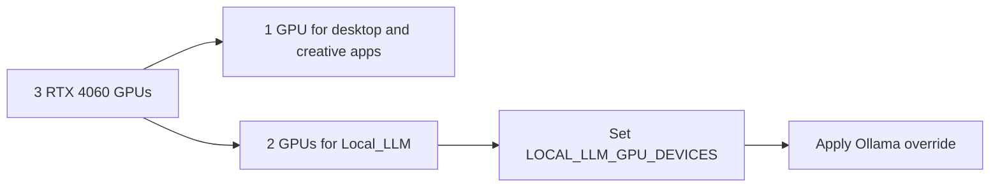

# GPU Reservation And Layout Guidance

## Purpose

This document explains how to operate the HP Z8 G4 Local_LLM host when one RTX 4060 should remain reserved for workstation display use.

## Short Version

For the current Skippy plan, the easy default is:

1. Keep one GPU for the workstation.
2. Give the other two GPUs to Local_LLM.
3. Confirm real GPU numbering with `nvidia-smi -L` before editing `/etc/default/local-llm`.

## Picture



## Core Constraint

The three RTX 4060 GPUs should be treated as separate devices.

For the first deployment, do not assume:

1. automatic VRAM pooling,
2. efficient single-model sharding across all cards, or
3. identical behavior across runtimes.

## Recommended Modes

## Mode 1: Dedicated Inference Host

Use all GPUs for inference workloads.

When to use it:

1. The workstation is managed remotely.
2. No interactive desktop workload needs to stay responsive.
3. Maximum inference capacity matters more than local console comfort.

Recommended setting:

1. `LOCAL_LLM_GPU_DEVICES=0,1,2`

Human meaning:

All GPUs are available to inference. This is only the better choice if no one needs the workstation desktop to stay smooth.

## Mode 2: Mixed Workstation Host

Reserve one GPU for desktop or console use and expose only the remaining GPUs to inference.

When to use it:

1. The workstation will keep a local desktop session.
2. One GPU should stay isolated from AI jobs.
3. Stability and console responsiveness matter more than absolute throughput.

Recommended setting:

1. `LOCAL_LLM_GPU_DEVICES=1,2`

Adjust the device list after validating actual GPU numbering with `nvidia-smi -L`.

Human meaning:

This is the safer default for Skippy because video editing, CAD, and the local desktop still matter.

Operational path:

1. Copy `src/local-llm.env.example` to `/etc/default/local-llm`.
2. Set `LOCAL_LLM_GPU_DEVICES` to the inference-only device list.
3. Install `src/apply-ollama-gpu-policy.sh` as `/usr/local/bin/apply-ollama-gpu-policy.sh`.
4. Run `/usr/local/bin/apply-ollama-gpu-policy.sh`.
5. Run `systemctl daemon-reload && systemctl restart ollama`.

Pass this section only when:

1. The environment file contains the right GPU list.
2. The override file exists.
3. Ollama restarted cleanly.

## Practical Guidance

1. Validate GPU numbering on the target host before setting any environment file.
2. Keep the first production model within a single-GPU-friendly size class even if multiple GPUs are available.
3. Use additional GPUs for future scale-out, separate workers, or later runtime experiments instead of assuming immediate multi-GPU gains.
4. Revalidate after driver upgrades because device ordering or behavior can change.

## Validation Commands

```sh
nvidia-smi -L
cat /etc/default/local-llm
cat /etc/systemd/system/ollama.service.d/override.conf
systemctl show ollama --property=Environment
```

## Operational Recommendation

The host is now explicitly a workstation for video editing and CAD work, so reserved-GPU mode should be treated as the default, not an optional edge case. The small loss in raw capacity is worth the stability and predictability for interactive creative workloads.

For this project, the default posture should be:

1. One GPU reserved for display and creative applications.
2. Remaining GPUs exposed to Ollama.
3. Model sizing chosen so inference pressure does not degrade editing or CAD responsiveness.