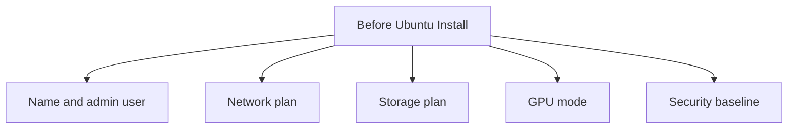

# Z8 G4 Host Preparation Checklist

## Purpose

Use this checklist before installing Ubuntu 24.04 LTS on the HP Z8 G4 Local_LLM host.

For the current mixed-workstation requirement, treat Ubuntu Studio 24.04 LTS as the preferred Linux choice unless the creative software requirements force a different host-OS decision.

The goal is to make BIOS, storage, networking, and GPU-role decisions explicit before software deployment begins.

## Short Version

Before installing Ubuntu, decide these five things:

1. What the host will be called.
2. How the host will get its IP address.
3. Which disks will hold OS, LLM data, and media data.
4. Whether one GPU stays reserved for the workstation.
5. Whether the first build stays LAN-only.

If these are not decided, stop and decide them first.

## Decision Picture

## Hardware Identity

Record these before changes:

1. Final hostname.
2. Asset label or serial number.
3. Planned LAN IP address or DHCP reservation.
4. Planned administrator account name.

For the current target, those values are expected to be Skippy, `192.168.128.5`, and `Daniel` unless you deliberately change the plan.

## BIOS And Firmware Checklist

1. Update the workstation BIOS and device firmware to a stable vendor-supported baseline.
2. Confirm UEFI boot mode is enabled.
3. Disable legacy boot unless a specific hardware requirement says otherwise.
4. Confirm virtualization support is enabled if containers or future nested workloads may matter.
5. Confirm all three RTX 4060 GPUs are visible in firmware and at POST.
6. Confirm PCIe slot layout and power delivery are stable.
7. If the host will run headless, confirm remote management and auto-power-recovery settings are appropriate.

Operator note:

Do not start Linux installation until the platform is stable enough to survive repeated reboot and driver cycles.

Pass this section only when:

1. Firmware is updated.
2. UEFI is correct.
3. All GPUs are visible before the OS install begins.

## Storage Layout Decision

Use a split layout rather than placing everything on one root filesystem.

For the current Skippy plan, storage should be optimized for Local_LLM first and video editing second.

Recommended layout:

1. SSD 1 for Ubuntu Studio, workstation applications, and base user data.
2. SSD 2 for models, Open WebUI state, container data, and future Local_LLM logs.
3. RAID10 HDD array for larger media project storage and bulk creative data.

Recommended mount targets:

1. `/` on SSD 1.
2. `/var/lib/ollama` on SSD 2.
3. `/var/lib/docker` on SSD 2.
4. `/srv/media` on the RAID10 HDD array.

Checklist:

1. Confirm the boot disk has enough space for Ubuntu, drivers, and updates.
2. Confirm SSD 2 has enough headroom for multiple models and container state.
3. Confirm the RAID controller can present a stable RAID10 set for the four 1 TB HDDs.
4. Decide whether model storage and Docker storage will share SSD 2 or be split further.
5. Decide whether the filesystem should favor simplicity over snapshots for the first deployment.

See `docs/storage-layout.md` for the current recommended Skippy layout.

Human summary:

1. SSD 1 is for Ubuntu and desktop responsiveness.
2. SSD 2 is for Local_LLM speed.
3. RAID10 is for large media.
4. The SMB share is optional and not part of the hot runtime path.

## Network Baseline

1. Use wired Ethernet only for the first deployment.
2. Decide whether the host will use a static IP or a DHCP reservation.
3. Confirm the default gateway, DNS servers, and management subnet.
4. Confirm SSH will be allowed from the operator workstation network.
5. If the service will later be published by name, reserve a DNS name now.

Recommended first approach:

1. DHCP reservation for simplicity if the router and DNS environment are already stable.
2. Static addressing only if the environment already uses host-managed static assignments consistently.

Pass this section only when:

1. You know how the host will keep the same address.
2. You know where SSH will come from.
3. You know whether a DNS name is needed later.

## GPU Role Decision

Decide this before software install:

1. Dedicated inference host mode: all three GPUs available to Linux inference workloads.
2. Mixed workstation mode: reserve one GPU for local display or console use and expose only the remaining GPUs to Ollama.

Recommended first approach:

1. Use dedicated inference host mode if the system will be managed over SSH only.
2. Use mixed workstation mode if the machine will keep a local desktop session.

For the current Skippy workstation build, mixed workstation mode is the default answer.

## Security Baseline

1. Enable only the services required for SSH, Ollama, and Open WebUI.
2. Keep the first rollout LAN-only.
3. Do not publish directly to the internet.
4. If HTTPS is required later, place named access behind a chosen reverse-proxy layer as a separate step.

Human summary:

The first working build should be simple, local, and reversible.

## Success Criteria

The host is ready for Ubuntu installation when:

1. BIOS and firmware decisions are complete.
2. Boot and data disk layout are decided.
3. Network addressing is decided.
4. The GPU reservation mode is decided.
5. A hostname and admin path are chosen.