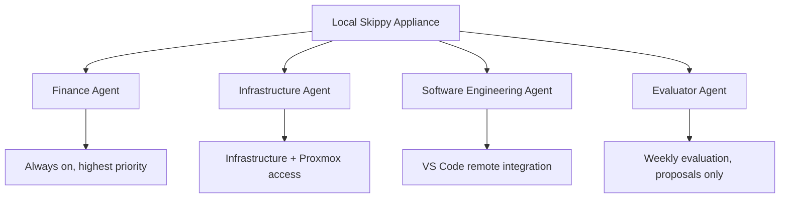

# Agent Topology

## Purpose

This document defines the four Hermes AI agents running on the Local Skippy appliance, including their roles, models, resource priorities, and access paths.

## Overview

## Agent Definitions

### Agent 1 — Finance

| Property | Value |
|---|---|
| Name | Finance |
| Role | Financial projects, analysis, and planning |
| Priority | Highest — always on |
| Model | `hermes-3-llama-3.1-8b` (or larger if VRAM allows) |
| Cloud fallback | See `docs/cloud-ai-integration.md` |
| Access | Open WebUI browser interface |
| Uptime target | Continuous — must survive host restarts |

System prompt focus:

- Financial analysis, modeling, and planning
- Precise and structured output
- No external tool calls unless explicitly approved
- Strict data-handling policy: do not store sensitive financial data in model context longer than a session

Resource notes:

- This agent has first claim on GPU resources when multiple agents are under load.
- Model instance should be kept warm (pre-loaded) if Ollama supports it.

### Agent 2 — Infrastructure

| Property | Value |
|---|---|
| Name | Infrastructure |
| Role | Local infrastructure setup and maintenance |
| Priority | High |
| Model | `hermes-3-llama-3.1-8b` |
| Cloud fallback | See `docs/cloud-ai-integration.md` |
| Access | Open WebUI browser interface |
| External access | Proxmox API (restricted token — see `docs/proxmox-integration.md`) |

System prompt focus:

- Ubuntu Server administration
- Docker and service management
- Proxmox cluster operations (bounded by API token scope)
- Infrastructure planning and IaC generation

Security requirements:

- Proxmox credentials must not be committed to this repository
- All infrastructure actions should be logged
- Destructive actions require explicit operator confirmation

### Agent 3 — Software Engineering

| Property | Value |
|---|---|
| Name | Software Engineering |
| Role | General software development and programming |
| Priority | Standard |
| Model | `hermes-3-llama-3.1-8b` or `deepseek-coder-v2` |
| Cloud fallback | See `docs/cloud-ai-integration.md` |
| Access | Open WebUI browser interface and VS Code remote SSH |

System prompt focus:

- Code generation, review, and debugging
- Architecture advice
- Test writing
- Documentation

VS Code integration:

- Access via SSH remote to the Skippy host from a development machine
- Project workspaces are local to the development machine or mounted from the Skippy host
- No special agent credentials required for coding work

### Agent 4 — Evaluator

| Property | Value |
|---|---|
| Name | Evaluator |
| Role | Weekly evaluation of server and agent performance |
| Priority | Low — scheduled weekly |
| Model | `hermes-3-llama-3.1-8b` |
| Cloud fallback | See `docs/cloud-ai-integration.md` |
| Access | Open WebUI browser interface |
| Schedule | Weekly, operator-initiated or scheduled |

System prompt focus:

- Review Ollama service logs and resource utilization
- Review Open WebUI usage logs
- Identify underperforming or underused agents
- Generate a structured weekly improvement report
- **Propose** changes — do not automatically implement them

Safety constraint:

- The Evaluator must not execute system changes without explicit operator approval
- See `docs/agent-policies.md` and `docs/weekly-evaluation.md`

## Model Recommendations

| Agent | Primary Local Model | Alternate Local Model | Notes |
|---|---|---|---|
| Finance | `hermes-3-llama-3.1-8b` | `hermes-3-llama-3.1-70b-q4` | Larger if VRAM allows |
| Infrastructure | `hermes-3-llama-3.1-8b` | `hermes-3-mistral-7b` | Tool-use focused |
| Software Engineering | `hermes-3-llama-3.1-8b` | `deepseek-coder-v2` | Code generation focus |
| Evaluator | `hermes-3-llama-3.1-8b` | — | Analysis and report generation |

## Access Summary

| Agent | Browser | API | VS Code Remote | External |
|---|---|---|---|---|
| Finance | Yes | Optional | No | No |
| Infrastructure | Yes | Optional | No | Proxmox (restricted) |
| Software Engineering | Yes | Optional | Yes | No |
| Evaluator | Yes | No | No | No |

## Configuration Files

Each agent's system prompt and profile is defined in `config/agents/`:

- `config/agents/finance.yaml`
- `config/agents/infrastructure.yaml`
- `config/agents/software-engineering.yaml`
- `config/agents/evaluator.yaml`
