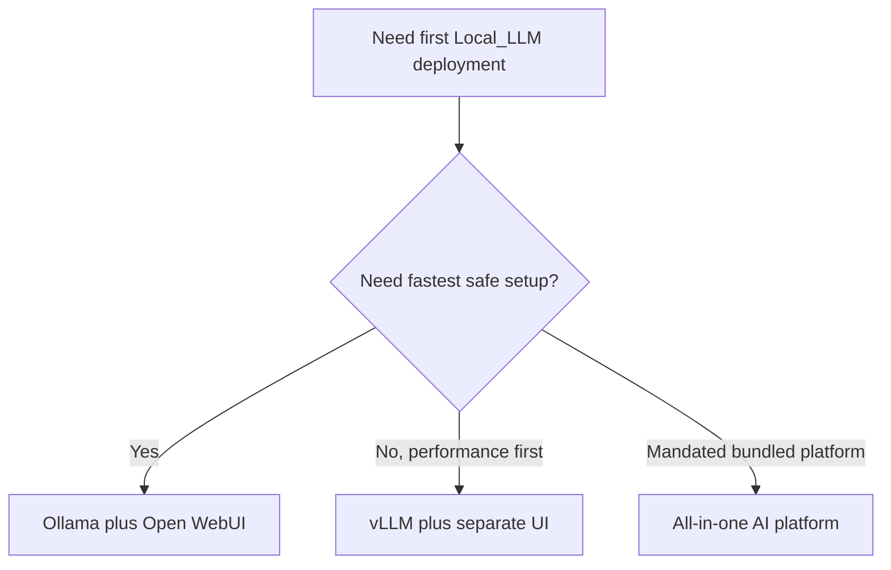

# Local LLM Architecture Options

## Goal

Choose a practical first architecture for serving local AI interactions on a Debian or Ubuntu host.

## Fast Answer

For this project, the current first-choice stack is already decided:

1. Ubuntu Server 26.04 LTS (headless).
2. Ollama.
3. Open WebUI.
4. LAN-only access first.
5. All 3 GPUs dedicated to Local_LLM inference.

Use the other options in this file only if the first build works and later performance needs force a change.

## Decision Picture

## Evaluation Criteria

Use these criteria when selecting the first stack:

1. Simple installation and rollback.
2. Reasonable hardware efficiency.
3. Browser-based user access for non-technical users.
4. Straightforward model import and switching.
5. Clear operational ownership on a single Linux host.

## Option 1: Ollama Plus Open WebUI

Summary:

Run Ollama as the local model runtime and expose Open WebUI for browser access.

Strengths:

1. Workable path to a working and efficient local AI service.
2. Large amount of community documentation.
3. Good fit for single-host LAN deployment.
4. Easy to pair with an existing reverse proxy.

Tradeoffs:

1. GPU passthrough and vendor drivers still need careful setup.
2. Large models can be slow or impractical on CPU-only hardware.
3. Operational controls are simpler than heavier multi-user AI platforms.

Recommendation:

This is the recommended starting point.

Human meaning:

Choose this unless you already know the first build will fail on performance grounds.

## Option 2: vLLM Plus A Separate Web UI

Summary:

Run a higher-performance inference engine such as vLLM and place a web UI in front of it.

Strengths:

1. Better fit for stronger GPU-backed hosts.
2. More efficient inference for some larger-model use cases.
3. Closer to an API-first architecture.

Tradeoffs:

1. Higher operational complexity.
2. Less suitable as the first deployment unless performance is already the main requirement.
3. Requires tighter version alignment between runtime, drivers, CUDA, and models.

Recommendation:

Revisit this after a successful first deployment if performance or concurrency becomes the limiting factor.

Human meaning:

Do not start here unless you are deliberately trading simplicity for performance tuning.

## Option 3: All-In-One AI Platform Distribution

Summary:

Adopt a bundled platform that packages runtime, web UI, and model management together.

Strengths:

1. Potentially faster operator onboarding.
2. A single product surface for some features.

Tradeoffs:

1. Platform lock-in and upgrade constraints.
2. Less transparent operations.
3. Often more moving parts than the first rollout needs.

Recommendation:

Not recommended for the first implementation unless a specific bundled product is already mandated.

Human meaning:

This is usually the wrong first move for a home or small-lab build because it hides too much complexity behind a heavier platform.

## Recommended First Build

The first deployment should use:

1. Ubuntu Server 26.04 LTS on the HP Z8 G4 in headless mode, dedicated to Local_LLM.
2. Ollama for local inference.
3. Open WebUI for browser access.
4. Optional local DNS and reverse-proxy tooling if named HTTPS access is required.
5. A LAN-only security boundary with no public exposure.
6. All 3 GPUs dedicated to Local_LLM inference.
7. No local desktop or workstation applications.

## OS Fit For Media And CAD Work

This project now has a stronger host constraint: the Z8 G4 must also handle video editing and CAD design.

Decision rule:

1. If the target creative applications are Linux-friendly, Ubuntu Studio 26.04 LTS is the best fit inside the current Local_LLM scope.
2. If the target creative applications are Windows-first, a Linux-only bare-metal plan is no longer the best recommendation.
3. In that Windows-first case, either separate the LLM role onto another Linux host or run the LLM stack in a Linux guest/runtime while keeping the workstation OS aligned with the creative software.

## Hardware-Specific Guidance For The Z8 G4

The current known target hardware is:

1. HP Z8 G4 workstation.
2. `128 GB` system RAM.
3. `3` NVIDIA GeForce RTX 4060 GPUs.

Implications:

1. System RAM is generous for the host OS, containers, caching, and multiple supporting services.
2. The three RTX 4060 cards make GPU acceleration realistic for local inference.
3. The deployment should assume one large shared GPU memory pool across all three cards.
4. For the first rollout, choose a runtime and models that work well on a single card, then use additional GPUs for parallel workers or future runtime upgrades if needed.

Practical starting model class:

1. Quantized 7B class models should be the safest baseline.
2. Quantized 13B to 14B class models may be practical depending on runtime overhead and target context size.
3. Larger models should be treated as a second-phase validation item rather than the first deployment assumption.

## Practical Decision Rule

If you are still unsure what to do, use this rule:

1. Build with Ollama plus Open WebUI.
2. Prove the host works locally.
3. Prove the workstation remains stable.
4. Only then revisit higher-performance runtimes.