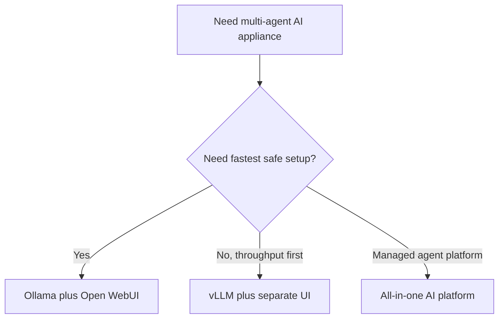

# Architecture Options

## Goal

Choose a practical first architecture for serving multi-agent AI interactions on a dedicated Ubuntu Server host.

## Fast Answer

For this project, the current first-choice stack is:

1. Ubuntu Server 24.04 LTS (headless).
2. Ollama (local model runtime).
3. Open WebUI (browser interface and agent profiles).
4. All three GPUs allocated to inference.
5. LAN-only access by default.

Use the other options in this file only if the first build works and later performance needs force a change.

## Decision Picture

## Evaluation Criteria

Use these criteria when selecting the first stack:

1. Simple installation and rollback on bare metal.
2. GPU acceleration for all three RTX 4060 cards.
3. Browser-based user access without a local desktop.
4. Multiple named agent profiles or model configurations.
5. Stable systemd-managed service lifecycle.
6. Optional cloud AI provider integration.

## Option 1: Ollama Plus Open WebUI (Recommended)

Summary:

Run Ollama as the local model runtime and expose Open WebUI for browser access and agent profile management.

Strengths:

1. Fastest path to a working multi-agent local AI service.
2. Open WebUI supports named model profiles with distinct system prompts — maps directly to four role-specific agents.
3. Good GPU utilization across multiple models.
4. Straightforward systemd and Docker lifecycle management.
5. Supports OpenAI-compatible API for tool integration.

Tradeoffs:

1. Open WebUI does not enforce strict scheduling priority between models by itself — resource priority must be managed at the Ollama or system level.
2. Hermes model variants should be validated for VRAM fit per GPU.

Recommendation:

This is the recommended starting point.

## Option 2: vLLM Plus A Separate Web UI

Summary:

Run a higher-performance inference engine such as vLLM and place a web UI in front of it.

Strengths:

1. Better throughput for concurrent inference workloads.
2. OpenAI-compatible API natively.
3. Tighter multi-GPU model sharding support.

Tradeoffs:

1. Higher operational complexity.
2. Less suitable as the first deployment unless performance is already the bottleneck.
3. Requires tighter version alignment between runtime, drivers, CUDA, and models.

Recommendation:

Revisit this after a successful first deployment if prompt throughput or concurrent-agent concurrency becomes the limiting factor.

## Option 3: All-In-One AI Platform Distribution

Summary:

Adopt a bundled platform that packages runtime, web UI, and model management together.

Strengths:

1. Potentially faster onboarding for managed deployments.
2. Single product surface.

Tradeoffs:

1. Platform lock-in.
2. Less transparent operations on bare metal.
3. More moving parts than necessary for a single-host build.

Recommendation:

Not recommended for this build.

## Recommended First Build

The first deployment should use:

1. Ubuntu Server 24.04 LTS on the HP Z8 G4 (headless, no GUI).
2. Ollama for local inference.
3. Open WebUI for browser access and agent profiles.
4. All three RTX 4060 GPUs allocated to inference.
5. LAN-only security boundary with no public exposure.
6. Optional cloud AI provider access via env file if needed.

## Hardware-Specific Guidance

The current target hardware:

1. HP Z8 G4.
2. `128 GB` system RAM.
3. `3` NVIDIA GeForce RTX 4060 GPUs.

Implications:

1. System RAM is generous for model overflow when GPU VRAM is saturated.
2. All three GPUs should be allocated to inference — no workstation role on this host.
3. Do not assume one large shared GPU memory pool across all three cards by default.
4. Start with Hermes-3 class quantized models per agent, sized to fit single-GPU VRAM.
5. Use 128 GB RAM for model overflow only after GPU VRAM is consumed.

## Model Recommendations Per Agent

| Agent | Recommended Local Model | Notes |
|---|---|---|
| Finance | `hermes-3-llama-3.1-8b` or `hermes-3-llama-3.1-70b-q4` | Highest priority; larger model if VRAM allows |
| Infrastructure | `hermes-3-llama-3.1-8b` | Tool-use and planning focus |
| Software Engineering | `hermes-3-llama-3.1-8b` or `deepseek-coder-v2` | Code generation focus |
| Evaluator | `hermes-3-llama-3.1-8b` | Analysis and report generation |

Cloud fallbacks per agent are documented in `docs/cloud-ai-integration.md`.