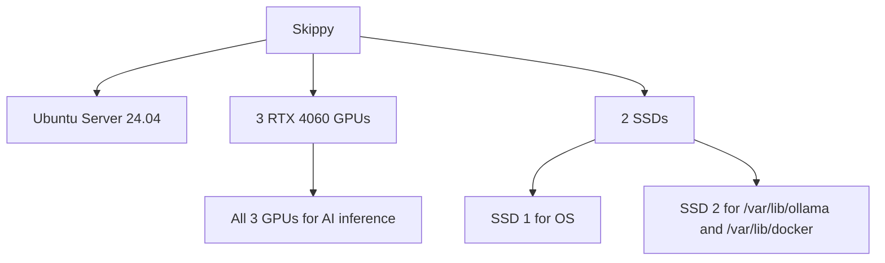

# Environment Inventory

## Purpose

Capture the host and service assumptions that matter before deploying the Local Skippy multi-agent AI appliance.

## Quick Read

Current working assumptions:

1. Host: HP Z8 G4.
2. Hostname: `Skippy` / `Skippy.aybara.local`.
3. IP: `192.168.128.5`.
4. Admin user: `Daniel`.
5. GPUs: `3` RTX 4060 cards, all three allocated to AI inference.
6. Storage: SSD 1 for OS, SSD 2 for Ollama models and Docker.
7. OS: Ubuntu Server 24.04 LTS (headless, no GUI).

## Environment Picture

## Target Platform

1. HP Z8 G4 on Ubuntu Server 24.04 LTS.
2. Headless — no desktop environment installed.
3. SSH administrative access only.
4. LAN connectivity for browser clients.

## Current Target Identity

1. Hostname: `Skippy`
2. LAN FQDN: `Skippy.aybara.local`
3. Planned LAN IP: `192.168.128.5`
4. Planned admin user: `Daniel`

## Current Known Hardware

1. Workstation-class host: HP Z8 G4.
2. Installed RAM: `128 GB`.
3. Installed GPUs: `3` NVIDIA GeForce RTX 4060.
4. Installed SSDs: `2` HP SSD FX900 Pro M.2 `1 TB` drives.
5. Installed HDDs: `4` physical `1 TB` drives attached to the RAID controller (spare/unused).

## Resource Allocation

1. All three GPUs allocated to AI inference — no workstation role.
2. GPU VRAM is the primary inference resource.
3. RAM overflow is used when VRAM is saturated.
4. CPU inference load is capped at approximately 75% utilization.
5. Finance agent holds highest scheduling priority.
6. SSD 1 for OS and system packages.
7. SSD 2 for Ollama models, Docker data, and Open WebUI state.

## Service Assumptions

1. Runtime: Ollama (systemd-managed).
2. Web UI: Open WebUI (Docker container, systemd-wrapped).
3. Agent profiles: four Hermes agent configurations in Open WebUI.
4. Access: LAN browser for users, SSH for admin.
5. Optional cloud AI: API keys in `/etc/default/local-llm`, never in the repository.

## Network

1. Primary access: `http://192.168.128.5:3000` or `http://skippy:3000`.
2. Admin: SSH on standard port (hardened per `docs/security-model.md`).
3. VS Code remote: SSH from development machine.
4. Proxmox: Infrastructure agent connects to separate Proxmox host via restricted API token.
5. No public internet exposure by default.

## Open Questions

1. Which physical GPU indices map to which `nvidia-smi` device numbers on first boot?
2. Should model storage be split across SSD 2 and the HDD array for archive models?
3. Should an optional reverse proxy with HTTPS be added for remote browser access outside the LAN?
4. What is the preferred concurrency target per agent?