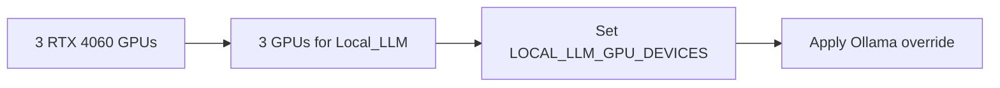

# GPU Reservation And Layout Guidance

## Purpose

This document explains GPU allocation for the HP Z8 G4 Local_LLM host—a headless server with all three RTX 4060 GPUs dedicated to local LLM inference.

## Short Version

For the current Skippy plan:

1. All three GPUs are dedicated to Local_LLM inference.
2. Confirm real GPU numbering with `nvidia-smi -L` before editing `/etc/default/local-llm`.

## Picture



## Core Constraint

The three RTX 4060 GPUs should be treated as separate devices.

For the first deployment, do not assume:

1. automatic VRAM pooling,
2. efficient single-model sharding across all cards, or
3. identical behavior across runtimes.

## Standard Configuration

### Dedicated Inference Host

All three GPUs are dedicated to inference workloads on this headless server.

Configuration:

1. `LOCAL_LLM_GPU_DEVICES=0,1,2`

Human meaning:

All GPUs are available to Local_LLM inference. The server has no interactive desktop workload, so maximum inference capacity is prioritized.

Operational path:

1. Copy `src/local-llm.env.example` to `/etc/default/local-llm`.
2. Set `LOCAL_LLM_GPU_DEVICES=0,1,2`.
3. Install `src/apply-ollama-gpu-policy.sh` as `/usr/local/bin/apply-ollama-gpu-policy.sh`.
4. Run `/usr/local/bin/apply-ollama-gpu-policy.sh`.
5. Run `systemctl daemon-reload && systemctl restart ollama`.

Pass this section only when:

1. The environment file contains the right GPU list.
2. The override file exists.
3. Ollama restarted cleanly.

## Practical Guidance

1. Validate GPU numbering on the target host before setting any environment file.
2. Keep the first production model within a single-GPU-friendly size class even if multiple GPUs are available.
3. Use additional GPUs for future scale-out, separate workers, or later runtime experiments instead of assuming immediate multi-GPU gains.
4. Revalidate after driver upgrades because device ordering or behavior can change.

## Validation Commands

```sh
nvidia-smi -L
cat /etc/default/local-llm
cat /etc/systemd/system/ollama.service.d/override.conf
systemctl show ollama --property=Environment
```

## Operational Recommendation

The host is explicitly dedicated to Local_LLM inference. All three GPUs should remain available to inference workloads.

For this project, the default posture is:

1. All GPUs exposed to Ollama.
2. Model sizing chosen for optimal throughput across available GPU memory.
3. No competing interactive workloads.