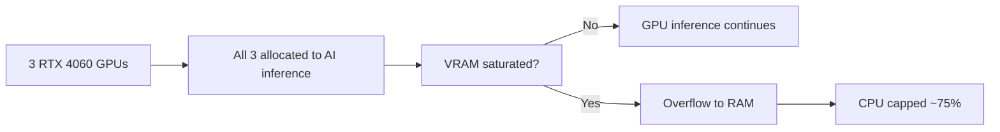

# GPU Strategy

## Purpose

This document defines the GPU resource allocation policy for the Local Skippy AI appliance.

The default posture is **GPU-first AI inference** using all three RTX 4060 cards, with RAM overflow and CPU capped at approximately 75% utilization.

## Policy Summary

1. All three RTX 4060 GPUs are allocated to AI inference by default.
2. No GPU is reserved for display or workstation use — this is a headless server.
3. GPU VRAM is the primary inference resource.
4. When VRAM is saturated, inference overflows to RAM.
5. CPU inference load is soft-capped at approximately 75% host utilization.
6. The Finance agent holds the highest resource scheduling priority.

## Picture



## GPU Device Configuration

Set the environment file to allocate all three GPUs:

```sh
# /etc/default/local-llm
LOCAL_LLM_GPU_DEVICES=0,1,2
LOCAL_LLM_EXPECTED_GPUS=3
```

Apply the Ollama systemd override:

```sh
sudo apply-ollama-gpu-policy.sh
sudo systemctl daemon-reload && sudo systemctl restart ollama
```

Verify:

```sh
nvidia-smi -L
systemctl show ollama --property=Environment
cat /etc/systemd/system/ollama.service.d/override.conf
```

## Why All Three GPUs

This is a dedicated headless AI server. There is no workstation role, no desktop session, and no creative application that needs a GPU. All available VRAM should be given to inference.

Three RTX 4060 GPUs at ~8 GB VRAM each provide approximately 24 GB of combined VRAM. With quantized Hermes models, this is enough to run:

- One 8B model per GPU simultaneously, or
- One 13B to 14B Q4 model spread across two GPUs via layer offloading, or
- One larger model with RAM overflow

## Resource Priority

Ollama does not enforce per-model CPU priority natively. Resource priority is managed at the systemd and cgroup level.

Finance agent priority:

1. The Finance agent runs continuously and is the highest-priority tenant.
2. If resource contention occurs, the Finance agent should be preserved first.
3. Use `nice` values, cgroup priority, or dedicated model instances if hard priority isolation is needed.

## RAM Overflow Policy

When GPU VRAM is saturated:

1. Ollama will automatically offload model layers to system RAM.
2. With 128 GB RAM, substantial overflow capacity is available.
3. Inference speed degrades when running on RAM versus VRAM — accept this for large context or multi-model scenarios.
4. Monitor RAM pressure with `free -h` and `ollama ps`.

## CPU Cap

1. CPU inference is slower than GPU — prefer GPU allocation for active agents.
2. Target: do not let AI workloads exceed approximately 75% sustained CPU utilization.
3. Monitor with `top` or `htop`. If sustained CPU exceeds 75%, reduce concurrency or switch to smaller models.
4. systemd CPUQuota can be applied to the ollama service unit if a hard cap is required.

## Validation Commands

```sh
# Check all three GPUs are visible
nvidia-smi -L

# Check which GPUs Ollama is using
systemctl show ollama --property=Environment

# Check current GPU utilization
nvidia-smi

# Check which models are loaded and their resource usage
ollama ps

# Check RAM consumption
free -h
```

## Revalidation

Revalidate GPU allocation after:

1. Driver upgrades.
2. Kernel upgrades.
3. Ollama service restarts.
4. Adding a new model that changes the active inference load.
