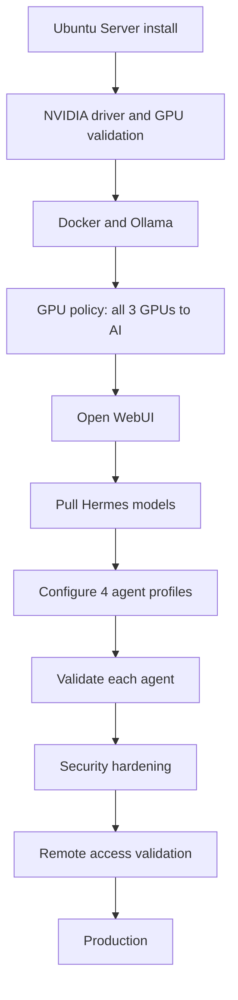

# Implementation Plan

## Objective

Deploy and operate a dedicated multi-agent AI appliance on Ubuntu Server 24.04 LTS, serving four always-available Hermes AI agents through Open WebUI with GPU-first inference.

## Short Version

1. Install Ubuntu Server 24.04 LTS on the HP Z8 G4.
2. Configure all three RTX 4060 GPUs for AI inference.
3. Install Ollama and Docker.
4. Deploy Open WebUI.
5. Pull Hermes models and configure each of the four agent profiles.
6. Validate all agents respond and the Finance agent is highest priority.
7. Apply security hardening and confirm remote access paths.

## Read These First

1. `docs/start-here.md`
2. `docs/agent-topology.md`
3. `docs/ubuntu-24.04-install-runbook.md`
4. `docs/gpu-strategy.md`
5. `docs/security-model.md`

## Plan Picture

## Current Default Decisions

Unless you deliberately change the plan, assume these defaults:

1. Host: HP Z8 G4.
2. OS: Ubuntu Server 24.04 LTS (headless, no GUI).
3. Runtime: Ollama.
4. Web UI: Open WebUI.
5. GPU mode: all three GPUs allocated to AI inference.
6. Resource priority: Finance agent highest, then Infrastructure, then Software Engineering.
7. Evaluator: scheduled weekly.
8. Network exposure: LAN-only by default.

## Phase 1: Host Baseline

1. Install Ubuntu Server 24.04 LTS on the HP Z8 G4.
2. Confirm all three RTX 4060 cards are recognized and accessible.
3. Apply all package updates before installing AI tooling.
4. Confirm SSH administrative access from the operator machine.
5. Confirm static IP or DHCP reservation is in place.
6. Prepare `/etc/default/local-llm` from `src/local-llm.env.example`.

Exit criteria:

1. Host is reachable by SSH.
2. `nvidia-smi -L` shows all three GPUs.
3. Hostname, IP, and admin user are finalized.

## Phase 2: Runtime

1. Install Docker Engine.
2. Install Ollama.
3. Apply the GPU policy with `src/apply-ollama-gpu-policy.sh` so all three GPUs are available to inference.
4. Pull the baseline Hermes model and run a smoke-test prompt.
5. Record GPU VRAM consumption baseline.

Exit criteria:

1. Ollama answers a local prompt using GPU acceleration.
2. All three GPUs appear in `nvidia-smi` and none are excluded from inference.
3. Service restarts cleanly.

## Phase 3: Open WebUI and Agent Profiles

1. Deploy Open WebUI using `src/run-open-webui.sh` and enable `src/local-llm-open-webui.service`.
2. Pull the four Hermes model variants needed for the agent profiles.
3. Create four named model configurations in Open WebUI, one per agent.
4. Set system prompts and personality profiles per `config/agents/`.
5. Assign resource priority settings for the Finance agent.

Exit criteria:

1. Open WebUI is reachable on the LAN.
2. Each of the four agents responds to a test prompt with the correct persona.
3. Finance agent shows highest priority and stays up under simulated load.

## Phase 4: Security and Remote Access

1. Apply SSH hardening from `docs/security-model.md`.
2. Configure UFW to allow only SSH and the Open WebUI port.
3. Validate VS Code remote SSH connection from a development machine.
4. Validate Proxmox integration credentials for the Infrastructure agent per `docs/proxmox-integration.md`.
5. Confirm no API keys or credentials are committed to the repository.

Exit criteria:

1. Only required ports are open.
2. SSH key authentication works and password auth is disabled.
3. Proxmox integration uses a restricted API token.

## Phase 5: Operations and Evaluation

1. Confirm all services restart cleanly after a full host reboot.
2. Run `src/validate-local-llm.sh` and confirm clean output.
3. Document the weekly evaluation workflow in `docs/weekly-evaluation.md`.
4. Schedule the Evaluator agent's first weekly review.
5. Enable optional cloud AI provider access if needed per `docs/cloud-ai-integration.md`.

Exit criteria:

1. All services survive reboot without manual intervention.
2. Validation script passes.
3. Evaluator agent completes a dry-run evaluation without system changes.

## Validation Checklist

1. SSH access works from the operator machine.
2. `nvidia-smi` shows all three GPUs active.
3. Ollama answers a local prompt.
4. Open WebUI is reachable from another LAN machine.
5. All four Hermes agents respond to test prompts.
6. Finance agent is highest priority.
7. UFW is active with only required ports open.
8. VS Code remote SSH connection works.
9. Proxmox API token is restricted and functional.
10. No credentials appear in any committed file.