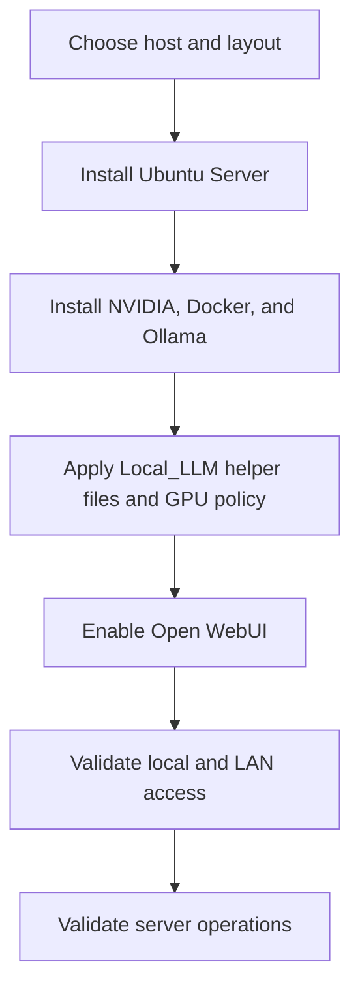

# Local LLM Implementation Plan

## Objective

Deploy a first local LLM server on Debian or Ubuntu that can serve browser-based AI interactions to users on the local network.

## Short Version

This project already has a practical default plan:

1. Use the HP Z8 G4 as a dedicated Local_LLM host.
2. Install Ubuntu Server 26.04 LTS.
3. Expose all three GPUs to inference.
4. Use Ollama plus Open WebUI.
5. Keep the first rollout LAN-only.
6. Validate the headless server workflow before adding optional extras.

## Read These First

1. `docs/start-here.md`
2. `docs/z8g4-host-prep-checklist.md`
3. `docs/storage-layout.md`
4. `docs/first-build-execution-checklist.md`
5. `docs/z8g4-install-commands.md`

## Plan Picture

The current preferred host build path is Ubuntu Server 26.04 LTS on the HP Z8 G4 for a dedicated Local_LLM deployment. Use `docs/ubuntu-server-26.04-install-runbook.md` as the primary implementation guide for the first deployment.
Use `docs/storage-layout.md` to keep the host optimized for Local_LLM first and bulk storage second.
Use `docs/post-install-server-validation.md` after the base build to confirm the final Skippy server posture.
Use `docs/z8g4-host-prep-checklist.md` before the OS install.
Use `docs/first-build-execution-checklist.md` when actually executing the first host build so the install order is explicit.
Use `docs/z8g4-install-commands.md` when you want the exact PowerShell and on-host command sequence rather than a checklist.

## Current Default Decisions

Unless you deliberately change the plan, assume these defaults:

1. Host: HP Z8 G4.
2. OS: Ubuntu Server 26.04 LTS.
3. Runtime: Ollama.
4. Web UI: Open WebUI.
5. GPU mode: all three GPUs available to Local_LLM.
6. Network exposure: LAN-only.

## Phase 1: Host Selection And Baseline

1. Use the HP Z8 G4 as the target Debian or Ubuntu host.
2. Confirm CPU, RAM, storage, and the exact GPU driver and CUDA-ready state for the three RTX 4060 cards.
3. Confirm SSH administration path and package update state.
4. Confirm the host has enough disk space for base software plus model storage.
5. Confirm all three GPUs will remain available to inference workloads.
6. Prepare `/etc/default/local-llm` from `src/local-llm.env.example` so the initial runtime and validation scripts have a stable configuration surface.

Exit criteria:

1. The host is reachable and updated.
2. Hardware limits are documented.
3. A baseline rollback approach is identified.

Human meaning:

Do not start runtime work until the machine identity, storage layout, and GPU plan are actually settled.

## Phase 2: Runtime Selection

1. Install Ollama on the selected host.
2. Verify local CLI inference with a small model first on one RTX 4060.
3. Select one primary assistant model and one smaller fallback model that fit comfortably within single-GPU limits.
4. Record model storage locations and service behavior.
5. Measure prompt latency and GPU utilization before attempting any multi-GPU or higher-performance runtime changes.
6. Constrain inference GPUs through the environment file and Ollama service override only if you later decide not to expose all three GPUs to Local_LLM.
7. Apply the override with `src/apply-ollama-gpu-policy.sh` so the GPU reservation survives reboot and service restart.

Exit criteria:

1. Local inference works from the host shell.
2. Startup and restart behavior are documented.
3. Model disk usage is understood.

Human meaning:

The runtime phase is complete only when a real prompt succeeds locally and you know which GPUs are being used.

## Phase 3: User Access Layer

1. Install Open WebUI or an equivalent browser front end.
2. Restrict access to the local network.
3. Decide whether to publish through a reverse proxy or stay on direct LAN access.
4. Validate browser access from at least one operator workstation.
5. Manage the Open WebUI container through the provided `src/run-open-webui.sh` helper and `src/local-llm-open-webui.service` unit instead of ad hoc Docker commands.

Exit criteria:

1. Users can reach the interface over the LAN.
2. The UI can send prompts to the local runtime.
3. Authentication requirements are documented.

Human meaning:

Do not add reverse proxy or named DNS until direct LAN access is already working.

## Phase 4: Operational Hardening

1. Define model update procedure.
2. Define service restart and validation procedure.
3. Decide whether host and service monitoring should be added, and document the chosen toolchain locally.
4. Document storage growth and backup expectations.
5. Document any GPU-specific restart or driver recovery steps.
6. Use `src/validate-local-llm.sh` as the first post-change validation pass after service changes.

Exit criteria:

1. Runbooks exist for restart, validation, and upgrade.
2. Basic monitoring expectations are documented.
3. Recovery expectations are explicit.

Human meaning:

These hardening tasks matter, but they are after the first working build, not before it.

## Initial Validation Checklist

1. SSH access to the host works.
2. The runtime answers a local prompt.
3. The web UI is reachable from another LAN machine.
4. If HTTPS is used, the published name resolves and serves correctly.
5. The selected model responds within acceptable latency for the target hardware.
6. GPU utilization confirms the runtime is actually using the intended RTX 4060 device set.