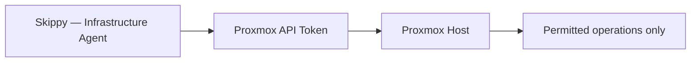

# Proxmox Integration

## Purpose

This document defines how the Infrastructure agent connects to the separate Proxmox host for infrastructure management tasks.

The Infrastructure agent uses a **restricted API token** — not root or admin credentials.

## Architecture



## Proxmox Host Assumptions

1. The Proxmox host is a separate physical or virtual machine on the LAN.
2. It is not the same host as Skippy.
3. The Proxmox API is accessible from Skippy's IP on the LAN.
4. Access is via HTTPS to the Proxmox API endpoint (default port 8006).

## Creating a Restricted API Token

On the Proxmox host:

1. Log in to the Proxmox web UI.
2. Go to **Datacenter → Permissions → API Tokens**.
3. Create a new token for a non-root user (e.g., `infra-agent@pve`).
4. **Do not assign Superuser role.** Assign only the minimum roles needed.
5. Note the token ID and secret — the secret is shown only once.

Recommended minimum permissions for the Infrastructure agent:

| Role | Scope | Notes |
|---|---|---|
| `PVEVMAdmin` | Specific VMs or pools | Only if VM management is needed |
| `PVEAuditor` | Datacenter | For read-only status checks |

Do not assign `Administrator` or root-equivalent roles to this token.

## Storing the Token

Store the Proxmox API token in the environment file or a separate secrets file:

```sh
# /etc/default/local-llm or /etc/local-skippy/secrets
PROXMOX_HOST=https://192.168.128.X:8006
PROXMOX_TOKEN_ID=infra-agent@pve!skippy
PROXMOX_TOKEN_SECRET=<token-secret>
```

Set permissions:

```sh
sudo chmod 600 /etc/default/local-llm
sudo chown root:root /etc/default/local-llm
```

**Never commit the token secret to this repository.**

## Using the Token from the Infrastructure Agent

The Infrastructure agent uses the token to:

1. Query VM and node status.
2. Start and stop VMs within its permitted scope.
3. Review storage and resource utilization.
4. Generate infrastructure reports.

When the Infrastructure agent generates Proxmox API commands, the operator reviews them before execution unless an explicit safe-automation list has been defined.

## Proxmox API Reference

The Proxmox REST API documentation is available on the Proxmox host at:

```
https://<proxmox-host>:8006/api2/json/
```

Use `pvesh` on the Proxmox host to test API calls interactively before integrating them into the Infrastructure agent workflow.

## Security Rules

1. The API token scope must be least-privilege — only what the Infrastructure agent actually needs.
2. All Proxmox operations performed under Infrastructure agent guidance are logged in the Proxmox audit log.
3. The token secret is never placed in prompts, conversation context, or any file committed to this repository.
4. If the token is compromised, revoke it from the Proxmox UI immediately and issue a new one.

## Validation

Test the Proxmox connection from the Skippy host:

```sh
# Using curl with the API token
curl -k -H "Authorization: PVEAPIToken=infra-agent@pve!skippy=<token-secret>" \
  https://<proxmox-host>:8006/api2/json/version
```

Expected result: a JSON response with the Proxmox version. If this fails, check the host address, token permissions, and firewall rules.
