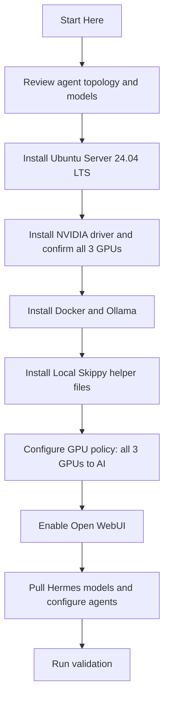

# Start Here

## Purpose

Use this file if you want the shortest path through the Local Skippy project.

If you only read one document before touching the host, read this one first.

## Fast Path

1. Read the current target values in `README.md`.
2. Review the four agents in `docs/agent-topology.md`.
3. Build the host with `docs/ubuntu-24.04-install-runbook.md`.
4. Review the disk plan in `docs/storage-layout.md`.
5. Confirm the GPU policy in `docs/gpu-strategy.md`.
6. Apply security hardening from `docs/security-model.md`.
7. Use `docs/operations.md` for day-to-day operation.

## Deployment Picture

## Read These In Order

1. `README.md` — project overview and target values
2. `docs/agent-topology.md` — the four agents, their models, priorities, and access paths
3. `docs/ubuntu-24.04-install-runbook.md` — Ubuntu Server build steps
4. `docs/gpu-strategy.md` — GPU-first AI resource policy
5. `docs/storage-layout.md` — disk layout for a headless server
6. `docs/security-model.md` — SSH, firewall, and access control
7. `docs/operations.md` — ongoing operation, update, and backup

## What You Can Ignore On The First Pass

Do not start with these unless you already know you need them:

1. Proxmox integration — set up after the host is stable.
2. Cloud AI integration — local-first by default.
3. Weekly evaluation workflow — start this once agents are running.
4. Named DNS and reverse proxy — add only after direct LAN access works.

## Stop Rules

Stop and fix the current step before continuing if any of these happen:

1. `nvidia-smi` does not show all three GPUs.
2. Docker or Ollama fails to start cleanly.
3. The environment file does not set `LOCAL_LLM_GPU_DEVICES=0,1,2`.
4. Open WebUI is not reachable on `http://127.0.0.1:3000` locally before LAN testing.
5. A Hermes model does not respond to a test prompt before being added to production.

## Human Summary

1. This is a dedicated headless server — no desktop, no creative apps, no workstation role.
2. All GPU capacity goes to AI inference.
3. Four Hermes agents are always available through a browser.
4. Admin is SSH-only.
5. The Finance agent has the highest resource priority and must stay up.