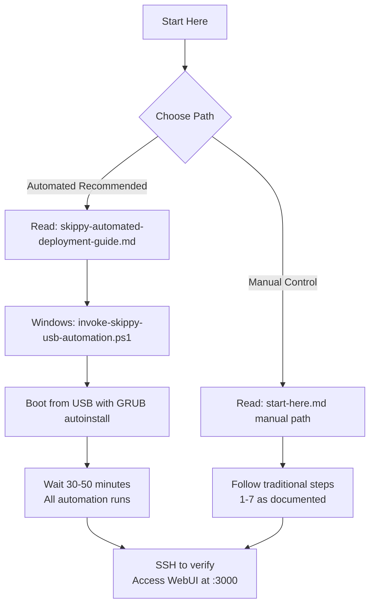
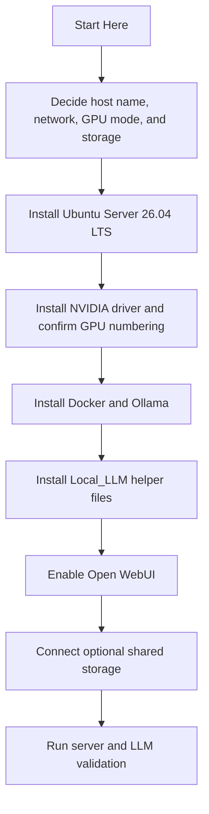

# Start Here

## Purpose

Use this file if you want the shortest path through the Local_LLM project.

If you only read one document before touching the host, read this one first.

## Fastest Path: Fully Automated (Recommended)

For the quickest hands-off deployment with minimal manual steps:

1. Read `docs/skippy-automated-deployment-guide.md` for the complete automation overview.
2. On Windows, run: `src/invoke-skippy-usb-automation.ps1` to prepare the USB.
3. Boot Z8 G4 from the USB and enter the GRUB autoinstall parameter.
4. Walk away for ~30-50 minutes while everything installs and boots automatically.
5. SSH in to verify Skippy is operational.
6. Access Open WebUI at `http://192.168.128.5:3000`

**Total time: 30-50 minutes, almost no manual intervention.**

## Manual Path: Traditional Command-by-Command (If Preferred)

If you prefer manual control or the automated approach doesn't work:

1. Read the current target values in `README.md`.
2. Use `docs/boot-day-checklist.md` at the machine during installation.
3. Make the host decisions in `docs/z8g4-host-prep-checklist.md`.
4. Confirm the disk plan in `docs/storage-layout.md`.
5. Build the machine with `docs/first-build-execution-checklist.md`.
6. Use `docs/z8g4-install-commands.md` or `docs/skippy-post-install-command-sequence.md` when you are ready to copy and paste commands.
7. Run `docs/post-install-server-validation.md` before calling the host ready.

## Deployment Picture: Automated Path

## Deployment Picture: Manual Path

## Read These In Order (Automated Path)

1. **`README.md`** for the overall plan and current target values.
2. **`docs/skippy-automated-deployment-guide.md`** for the complete automation flow (start here for automation).
3. **`src/README.md`** to understand the automation artifacts.
4. Run **`src/invoke-skippy-usb-automation.ps1`** to prepare the USB.

## Read These In Order (Manual Path)

1. `README.md` for the overall plan and current target values.
2. `docs/boot-day-checklist.md` for the condensed install-day sequence.
3. `docs/z8g4-host-prep-checklist.md` for the decisions you must finish before installing Ubuntu.
4. `docs/storage-layout.md` for the final disk and share layout.
5. `docs/first-build-execution-checklist.md` for the overall build order.
6. `docs/z8g4-install-commands.md` for exact commands.
7. `docs/skippy-post-install-command-sequence.md` for the condensed Skippy-specific command path.
8. `docs/post-install-server-validation.md` for the final proof that Skippy is operational.

## What You Can Ignore On The First Pass

Do not start with these unless you already know you need them:

1. Named DNS publication.
2. Reverse proxy publication.
3. Monitoring and backup improvements.
4. The legacy workstation-specific documents unless you intentionally restore that deployment model.

## Stop Rules

Stop and fix the current step before continuing if any of these happen:

1. `nvidia-smi` does not show all expected GPUs.
2. Docker or Ollama fails to start cleanly.
3. The Local_LLM environment file does not match the intended GPU split.
4. Open WebUI is not reachable on `http://127.0.0.1:3000` locally before LAN testing.

## Human Summary

The safe operator path is simple:

1. Decide the layout.
2. Install the OS.
3. Validate GPUs.
4. Install runtime and helpers.
5. Test locally.
6. Test from the LAN.
7. Only then add optional shared storage and hardening.