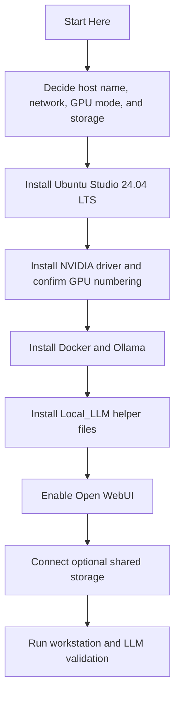

# Start Here

## Purpose

Use this file if you want the shortest path through the Local_LLM project.

If you only read one document before touching the host, read this one first.

## Fast Path

1. Read the current target values in `README.md`.
2. Make the host decisions in `docs/z8g4-host-prep-checklist.md`.
3. Confirm the disk plan in `docs/storage-layout.md`.
4. Build the machine with `docs/first-build-execution-checklist.md`.
5. Use `docs/z8g4-install-commands.md` when you are ready to copy and paste commands.
6. Run `docs/post-install-workstation-validation.md` before calling the workstation ready.

## Deployment Picture

## Read These In Order

1. `README.md` for the overall plan and current target values.
2. `docs/z8g4-host-prep-checklist.md` for the decisions you must finish before installing Ubuntu.
3. `docs/storage-layout.md` for the final disk and share layout.
4. `docs/first-build-execution-checklist.md` for the overall build order.
5. `docs/z8g4-install-commands.md` for exact commands.
6. `docs/post-install-workstation-validation.md` for the final proof that Skippy is usable.

## What You Can Ignore On The First Pass

Do not start with these unless you already know you need them:

1. Named DNS publication.
2. Reverse proxy publication.
3. Monitoring and backup improvements.
4. CAD or Resolve tuning beyond the first validation pass.

## Stop Rules

Stop and fix the current step before continuing if any of these happen:

1. `nvidia-smi` does not show all expected GPUs.
2. Docker or Ollama fails to start cleanly.
3. The Local_LLM environment file does not match the intended GPU split.
4. Open WebUI is not reachable on `http://127.0.0.1:3000` locally before LAN testing.

## Human Summary

The safe operator path is simple:

1. Decide the layout.
2. Install the OS.
3. Validate GPUs.
4. Install runtime and helpers.
5. Test locally.
6. Test from the LAN.
7. Only then add optional shared storage and workstation tuning.