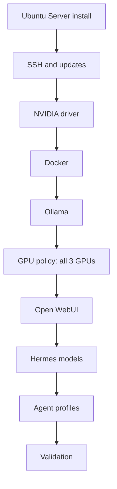

# Ubuntu Server 24.04 Install Runbook

## Purpose

Use this runbook to build the Local Skippy AI appliance on the HP Z8 G4 with Ubuntu Server 24.04 LTS.

The target outcome is a headless LAN-reachable multi-agent AI server with NVIDIA drivers, Ollama, Open WebUI, and all four Hermes agent profiles configured.

## Short Version

1. Install Ubuntu Server 24.04 LTS — headless, no desktop.
2. Enable SSH during install and confirm remote access.
3. Install the NVIDIA driver and record `nvidia-smi -L` output.
4. Install Docker and Ollama.
5. Apply GPU policy: all three GPUs to inference.
6. Deploy Open WebUI.
7. Pull Hermes models and configure agent profiles.
8. Run validation.

## Build Picture



## Stop Rules

Do not continue to the next phase if any of these are still broken:

1. SSH access does not work.
2. `nvidia-smi` does not show all three GPUs.
3. Docker or Ollama does not start cleanly.
4. Open WebUI does not answer locally on `http://127.0.0.1:3000`.

## Phase 1: Base OS Install

1. Install Ubuntu Server 24.04 LTS on the HP Z8 G4.
2. Choose Ubuntu Server (not Ubuntu Studio, not Ubuntu Desktop).
3. Enable OpenSSH Server during setup.
4. Do not install any desktop environment.
5. Apply all available package updates after first boot.
6. Confirm remote SSH access works before proceeding with AI tooling.

```sh
hostnamectl
lsb_release -a
ip address
sudo apt update && sudo apt full-upgrade -y
```

Operator checkpoints:

1. The host boots cleanly.
2. SSH works from the operator machine.
3. No desktop environment is present.
4. The host has current updates before GPU tooling is installed.

## Phase 2: NVIDIA Driver Baseline

1. Confirm all three RTX 4060 cards are visible to the OS.
2. Install the recommended Ubuntu NVIDIA driver.
3. Reboot if required.
4. Validate `nvidia-smi` sees all three GPUs.

```sh
lspci | grep -i nvidia
ubuntu-drivers devices
sudo ubuntu-drivers autoinstall
sudo reboot
nvidia-smi
nvidia-smi -L
```

Expected result:

1. All three GPUs appear in `nvidia-smi`.
2. Driver version is current on the Ubuntu-supported path.
3. No card is missing unexpectedly.

Record the exact GPU indices from `nvidia-smi -L`. These will be used in the environment file.

Operator checkpoints:

1. All three GPUs appear.
2. You have recorded the real GPU numbering.

## Phase 3: Container Prerequisites

1. Install Docker Engine.
2. Enable Docker at boot.
3. Install NVIDIA container toolkit so Docker containers can access GPUs.

```sh
sudo apt install -y docker.io
sudo systemctl enable --now docker
sudo apt install -y nvidia-container-toolkit
sudo nvidia-ctk runtime configure --runtime=docker
sudo systemctl restart docker
docker --version
```

Operator checkpoints:

1. Docker is active.
2. Docker starts at boot.
3. NVIDIA container toolkit is installed.

## Phase 4: Ollama Install

1. Install Ollama on the host.
2. Start and enable the Ollama service.
3. Copy `src/local-llm.env.example` to `/etc/default/local-llm`.
4. Set `LOCAL_LLM_GPU_DEVICES=0,1,2` to expose all three GPUs to Ollama.
5. Install and run `src/apply-ollama-gpu-policy.sh` to write the systemd override.
6. Pull a small test model and run a prompt.

```sh
curl -fsSL https://ollama.com/install.sh | sh
sudo systemctl enable --now ollama
sudo cp src/local-llm.env.example /etc/default/local-llm
# Edit /etc/default/local-llm and confirm LOCAL_LLM_GPU_DEVICES=0,1,2
sudo install -m 755 src/apply-ollama-gpu-policy.sh /usr/local/bin/apply-ollama-gpu-policy.sh
sudo apply-ollama-gpu-policy.sh
sudo systemctl daemon-reload && sudo systemctl restart ollama
ollama pull llama3.1:8b
ollama run llama3.1:8b "Respond with the word ready."
```

Operator checkpoints:

1. Ollama runs and uses GPU acceleration.
2. All three GPUs are available to inference.
3. The environment file reflects `LOCAL_LLM_GPU_DEVICES=0,1,2`.

## Phase 5: Open WebUI

1. Install the Open WebUI container using the provided helpers.
2. Enable the systemd service.

```sh
sudo install -m 755 src/run-open-webui.sh /usr/local/bin/local-llm-run-open-webui.sh
sudo cp src/local-llm-open-webui.service /etc/systemd/system/
sudo systemctl daemon-reload
sudo systemctl enable --now local-llm-open-webui.service
sudo docker ps
curl -I http://127.0.0.1:3000
```

Operator checkpoints:

1. The Open WebUI container is running.
2. The local WebUI endpoint answers on port 3000.

## Phase 6: Hermes Models and Agent Profiles

1. Pull the Hermes model variants for the four agents.
2. In Open WebUI, create four named model configurations.
3. Apply system prompts and priorities from `config/agents/`.

```sh
ollama pull nous-hermes-2-mistral-7b-dpo
# Pull additional variants as defined in docs/agent-topology.md
```

Open WebUI agent setup:

1. Open `http://192.168.128.5:3000` from a LAN browser.
2. Create model configurations named: Finance, Infrastructure, Software Engineering, Evaluator.
3. Assign system prompts from `config/agents/*.yaml`.
4. Set Finance agent to highest priority.

Operator checkpoints:

1. All four agent configurations respond to test prompts.
2. Finance agent is designated highest priority.

## Phase 7: LAN Publication

1. Keep the first deployment LAN-only.
2. Validate direct access on `http://192.168.128.5:3000` from another machine.
3. Only add reverse-proxy publication after the direct path works.

## Phase 8: Final Validation

```sh
systemctl status ollama --no-pager
systemctl status local-llm-open-webui.service --no-pager
sudo docker ps
nvidia-smi
df -h
/usr/local/bin/validate-local-llm.sh
```

Operator checkpoints:

1. Ollama restarts after reboot.
2. Open WebUI restarts after reboot.
3. All three GPUs are active and visible.
4. Validation script passes.

## Recommended First Models

| Agent | Model |
|---|---|
| Finance | `hermes-3-llama-3.1-8b` (or larger if VRAM allows) |
| Infrastructure | `hermes-3-llama-3.1-8b` |
| Software Engineering | `hermes-3-llama-3.1-8b` or `deepseek-coder-v2` |
| Evaluator | `hermes-3-llama-3.1-8b` |

Start with single-GPU-sized quantized models. Use multi-GPU for larger models after the baseline is working.

## Hardening Follow-Up

After the base deployment works, apply:

1. SSH key authentication and disable password auth — see `docs/security-model.md`.
2. UFW firewall with only required ports open.
3. Optional named DNS and reverse-proxy for browser access.
4. Backup for Open WebUI state and Ollama model inventory — see `docs/operations.md`.
5. Proxmox API token setup for the Infrastructure agent — see `docs/proxmox-integration.md`.

## Minimum Success Criteria

The host build is successful when:

1. Ubuntu Server 24.04 is updated and remotely reachable by SSH.
2. `nvidia-smi` shows all three RTX 4060 devices.
3. Ollama answers a local prompt using GPU acceleration.
4. Open WebUI is reachable from another LAN machine.
5. All four agent profiles respond to test prompts.
6. The deployment survives a full reboot without manual recovery steps.
