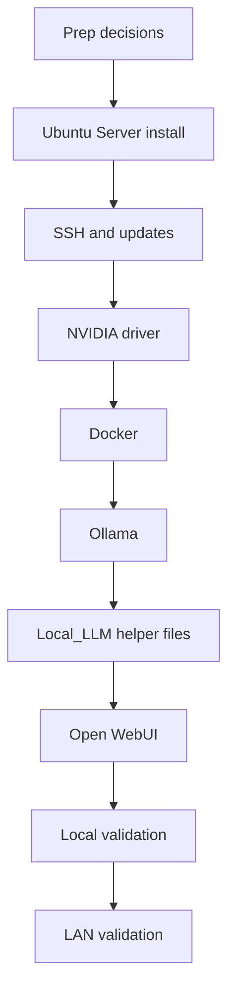

# Ubuntu Server 26.04 Install Runbook For Local LLM

## Purpose

Use this runbook to build the first Local_LLM host on the HP Z8 G4 with Ubuntu Server 26.04 LTS.

The target outcome is a LAN-reachable LLM server with NVIDIA drivers, Ollama, and Open WebUI installed in a maintainable baseline configuration.

## Short Version

If you want the shortest safe path, do this in order:

1. Finish the host decisions before installing Ubuntu.
2. Install Ubuntu Server 26.04 LTS and confirm SSH works.
3. Install the NVIDIA driver and record `nvidia-smi -L` output.
4. Install Docker and Ollama.
5. Install the Local_LLM helper files from `src/`.
6. Set the GPU list in `/etc/default/local-llm`.
7. Enable Open WebUI.
8. Test locally first.
9. Test from another LAN machine second.

## Build Picture



## Stop Rules

Do not continue to the next phase if any of these are still broken:

1. SSH access does not work.
2. `nvidia-smi` does not show all expected GPUs.
3. Docker or Ollama does not start cleanly.
4. Open WebUI does not answer locally on `http://127.0.0.1:3000`.

## Recommended Host Baseline

1. Ubuntu Server 26.04 LTS.
2. SSH enabled during install.
3. Static or DHCP-reserved LAN address.
4. One administrative user named `daniel` plus `sudo` access.
5. Dedicated inference host mode by default.

For the current Skippy target, read `docs/storage-layout.md` before installation so the SSD, RAID10, and SMB-share roles stay consistent.

## Why Ubuntu Server 26.04

1. It matches the current installer media already prepared for Skippy.
2. A headless server posture fits the current dedicated-host direction better than a desktop-oriented install.
3. Ubuntu remains well-documented for consumer RTX AI workloads, Docker, Ollama, and Open WebUI.
4. The first deployment does not require a local desktop session.

## Automated USB Install Path (Drive D)

If `D:` is your Ubuntu Server 26.04 USB installer, you can automate most of the first-build flow with repository scripts.

From PowerShell in the repository root, run the one-command orchestrator:

```powershell
pwsh -File .\src\invoke-skippy-usb-automation.ps1
```

The command runs a preflight checklist, prompts for the admin password, generates a Linux SHA-512 crypt hash, and writes unattended install files to `D:\nocloud`.

If you need explicit control, use:

1. `src/new-linux-password-hash.ps1` for hash generation.
2. `src/prepare-ubuntu-server-26.04-usb-autoinstall.ps1` for direct USB preparation.

Then boot from USB and append this to the GRUB Linux boot line:

```text
autoinstall ds=nocloud\;s=/cdrom/nocloud/
```

After first boot and SSH login, run:

```sh
sudo /opt/local-llm-src/bootstrap-local-llm-host.sh
```

This bootstrap script installs core packages, enables Docker and Ollama, installs repository helper files, applies GPU policy, enables Open WebUI, and runs validation.

## Pre-Install Decisions

Capture these before touching the host:

1. Final hostname.
2. Planned LAN IP address or DHCP reservation.
3. Whether all three RTX 4060 devices will remain available to inference.
4. Whether model storage should live on the OS disk or a separate data volume.
5. Whether the first rollout is operator-only or multi-user on day one.

Use `docs/z8g4-host-prep-checklist.md` to complete these decisions before the OS install starts.

## Installation Sequence

Use `docs/z8g4-install-commands.md` when you want exact commands. Use this runbook when you want the logic behind the order.

## Phase 1: Base OS Install

1. Install Ubuntu Server 26.04 LTS on the Z8 G4.
2. Enable OpenSSH Server during setup.
3. Create the administrative user as `daniel` and keep the default `sudo` access.
4. Enter the account password interactively during setup rather than storing it in repository docs.
5. Apply all available package updates after first boot.
6. Confirm remote SSH access works before proceeding with AI tooling.

Suggested validation:

```sh
hostnamectl
lsb_release -a
ip address
sudo apt update
sudo apt full-upgrade -y
```

Operator checkpoints:

1. The host boots cleanly.
2. SSH works from the operator machine.
3. The host has current updates before GPU tooling is installed.

## Phase 2: NVIDIA Driver Baseline

1. Confirm the three RTX 4060 cards are visible to the OS.
2. Install the recommended Ubuntu NVIDIA driver.
3. Reboot if required.
4. Validate `nvidia-smi` sees the intended GPUs.

Suggested validation:

```sh
lspci | grep -i nvidia
ubuntu-drivers devices
sudo ubuntu-drivers autoinstall
sudo reboot
nvidia-smi
nvidia-smi -L
```

Expected result:

1. All three GPUs appear in `nvidia-smi`.
2. Driver version is current on the Ubuntu-supported path.
3. No card is missing unexpectedly.

Operator checkpoints:

1. All three GPUs appear.
2. You have written down the real GPU numbering.
3. You know whether you will expose all three GPUs or a reduced set to Local_LLM.

## Phase 3: Container And Runtime Prerequisites

1. Install Docker Engine using the Ubuntu-supported package path or the standard path you choose for this repository.
2. Enable Docker at boot.
3. Install NVIDIA container support only if the chosen Open WebUI deployment path needs GPU-aware containers later.

Suggested validation:

```sh
sudo apt install -y docker.io
sudo systemctl enable --now docker
sudo systemctl status docker --no-pager
docker --version
```

Operator checkpoints:

1. Docker is active.
2. Docker starts at boot.

## Phase 4: Ollama Install

1. Install Ollama on the host.
2. Start and enable the Ollama service.
3. Pull a small test model first.
4. Run a prompt locally from the shell.

Suggested validation:

```sh
curl -fsSL https://ollama.com/install.sh | sh
sudo systemctl enable --now ollama
systemctl status ollama --no-pager
ollama pull llama3.1:8b
ollama run llama3.1:8b "Respond with the word ready."
```

Operator note:

Start with one single-GPU-friendly quantized model. Do not begin by chasing the largest model that might barely fit.

Preferred repository-backed path:

1. Copy `src/local-llm.env.example` to `/etc/default/local-llm`.
2. Set `LOCAL_LLM_GPU_DEVICES` to the desired inference device list.
3. Install `src/apply-ollama-gpu-policy.sh` as `/usr/local/bin/apply-ollama-gpu-policy.sh`.
4. Run `/usr/local/bin/apply-ollama-gpu-policy.sh`.
5. Run `systemctl daemon-reload && systemctl restart ollama`.

Operator checkpoints:

1. Ollama runs locally.
2. The first model responds.
3. The GPU decision is reflected in the environment file before user access is enabled.

## Phase 5: Open WebUI Install

The simplest first deployment path is a containerized Open WebUI instance that talks to local Ollama.

The repository includes host-side scaffolding for this deployment:

1. `src/local-llm.env.example`
2. `src/run-open-webui.sh`
3. `src/local-llm-open-webui.service`
4. `src/apply-ollama-gpu-policy.sh`

Preferred operational path:

1. Copy `src/local-llm.env.example` to `/etc/default/local-llm`.
2. Install `src/run-open-webui.sh` as `/usr/local/bin/local-llm-run-open-webui.sh`.
3. Install `src/local-llm-open-webui.service` under `/etc/systemd/system/`.
4. Run `systemctl daemon-reload` and `systemctl enable --now local-llm-open-webui.service`.

Suggested validation:

```sh
sudo docker ps
curl -I http://127.0.0.1:3000
```

Operator checkpoints:

1. The Open WebUI container is running.
2. The local WebUI endpoint answers.

## Phase 6: LAN Publication

1. Keep the first deployment LAN-only.
2. Validate direct access on `http://host-or-ip:3000` first.
3. Only add reverse-proxy publication after the direct path works cleanly.
4. If HTTPS publication is desired, add any DNS and reverse-proxy layer as an explicit follow-up rather than a hidden prerequisite.

## Phase 7: First Operational Checks

1. Confirm Ollama restarts cleanly after reboot.
2. Confirm Open WebUI starts automatically.
3. Record model storage location and disk consumption.
4. Record which GPU or GPUs are intended for inference.
5. Run the repository validation helper after installation changes.

Suggested validation:

```sh
systemctl status ollama --no-pager
systemctl status local-llm-open-webui.service --no-pager
sudo docker ps
nvidia-smi
df -h
/usr/local/bin/validate-local-llm.sh
```

Operator checkpoints:

1. Ollama restarts after reboot.
2. Open WebUI restarts after reboot.
3. The final disk usage matches the intended SSD and RAID roles.

## Recommended First Models

Start with one of these model classes:

1. A 7B to 8B instruct model as the primary baseline.
2. A second smaller fallback model for fast smoke tests.

Do not treat 128 GB of system RAM as a substitute for GPU VRAM when choosing the first production model.

## Hardening Follow-Up

After the base deployment works, add:

1. A named DNS endpoint.
2. Reverse-proxy publication if browser UX should match the rest of the local platform.
3. Backup guidance for Open WebUI state and Ollama model inventory.
4. Monitoring for host reachability, Ollama service health, and web UI availability.

## Minimum Success Criteria

The host build is successful when:

1. Ubuntu Server 26.04 is updated and remotely reachable.
2. `nvidia-smi` shows the expected RTX 4060 devices.
3. Ollama answers a local prompt successfully.
4. Open WebUI is reachable from another LAN machine.
5. The deployment can be rebooted without manual recovery steps.
